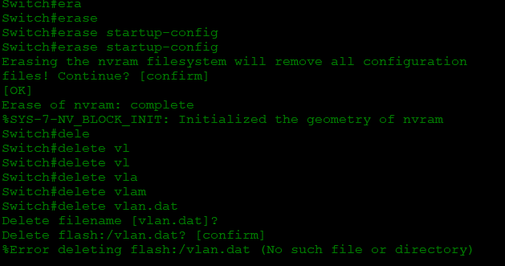
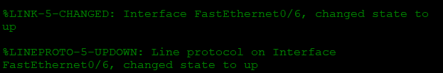
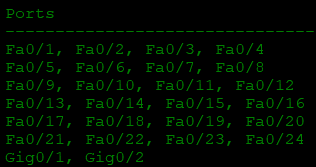

**Лабораторная работа. Базовая настройка коммутатора**

**Лабораторная работа. Базовая настройка коммутатора** 

# **Топология**

# **Таблица адресации**

|**Устройство**|**Интерфейс**|**IP-адрес / префикс**|
| :-: | :-: | :-: |
|S1|VLAN 1|192.168.1.2 /24|
|*S1*|*VLAN 99*||
|*S1*|*VLAN 99*||
|PC-A|NIC|192.168.1.10 /24|
|*PC-A*|*NIC*||
|*PC-A*|*NIC*||
# **Задачи**
**Часть 1. Проверка конфигурации коммутатора по умолчанию**

**Часть 2. Создание сети и настройка основных параметров устройства**

- Настройте базовые параметры коммутатора.
- Настройте IP-адрес для ПК.

**Часть 3. Проверка сетевых подключений**

- Отобразите конфигурацию устройства.
- Протестируйте сквозное соединение, отправив эхо-запрос.
- Протестируйте возможности удаленного управления с помощью Telnet.
  #
  # **Общие сведения/сценарий**
На коммутаторах Cisco можно настроить особый IP-адрес, который называют виртуальным интерфейсом коммутатора (SVI). SVI или адрес управления можно использовать для удаленного доступа к коммутатору в целях отображения или настройки параметров. Если для SVI сети VLAN 1 назначен IP-адрес, то по умолчанию все порты в сети VLAN 1 имеют доступ к IP-адресу управления SVI. 

В ходе данной лабораторной работы вам предстоит построить простую топологию, используя Ethernet-кабель локальной сети, и получить доступ к коммутатору Cisco, используя консольное подключение и методы удаленного доступа. Перед настройкой базовых параметров коммутатора нужно проверить настройки коммутатора по умолчанию. В число таких основных параметров коммутации входят имя устройства, описание интерфейса, локальные пароли, объявление дня (MOTD), IP-адрес и статический MAC-адрес. Необходимо также показать использование IP-адреса управления для удаленного управления коммутатором. Топология включает один коммутатор и один узел с использованием только портов Ethernet и консольных портов.

**Примечание.** В лабораторной работе используются коммутаторы Cisco Catalyst 2960s с операционной системой Cisco IOS 15.2(2) (образ lanbasek9). Допускается использование других моделей коммутаторов и других версий Cisco IOS. В зависимости от модели устройства и версии Cisco IOS доступные команды и результаты их выполнения могут отличаться от тех, которые показаны в лабораторных работах.** 

**Примечание**: Убедитесь, что все настройки коммутатора удалены и загрузочная конфигурация отсутствует. Если вы не уверены, обратитесь к инструктору. Процедура инициализации и перезагрузки коммутатора описана в приложении А.

*Закройте окно настройки.*
# **Необходимые ресурсы**
- 1 коммутатор (Cisco 2960 с ПО Cisco IOS версии 15.2(2) с образом lanbasek9 или аналогичная модель)
- 1 ПК (под управлением Windows с программой эмуляции терминала, например, Tera Term)
- 1 консольный кабель для настройки устройства на базе Cisco IOS через консольный порт.
- 1 кабель Ethernet, как показано в топологии.
  1. ## **Создание сети и проверка настроек коммутатора по умолчанию**
В первой части лабораторной работы вам предстоит настроить топологию сети и проверить настройку коммутатора по умолчанию.
1. ### **Создайте сеть согласно топологии.**
   1. Подсоедините консольный кабель, как показано в топологии. На данном этапе не подключайте кабель Ethernet компьютера PC-A.

**Примечание.** При использовании Netlab отключите интерфейс F0/6 на коммутаторе S1. Это имеет такой же эффект, как отсоединение компьютера PC-A от коммутатора S1.

1. Установите консольное подключение к коммутатору с компьютера PC-A с помощью Tera Term или другой программы эмуляции терминала.
#### Вопрос:
Почему нужно использовать консольное подключение для первоначальной настройки коммутатора? Почему нельзя подключиться к коммутатору через Telnet или SSH?
1. ### **Проверьте настройки коммутатора по умолчанию.**
На данном этапе вам нужно проверить такие параметры коммутатора по умолчанию, как текущие настройки коммутатора, данные IOS, свойства интерфейса, сведения о VLAN и флеш-память.

Все команды IOS коммутатора можно выполнять из привилегированного режима. Доступ к привилегированному режиму нужно ограничить с помощью пароля, чтобы предотвратить неавторизованное использование устройства — через этот режим можно получить прямой доступ к режиму глобальной конфигурации и командам, используемым для настройки рабочих параметров. Пароли можно будет настроить чуть позже.

К привилегированному набору команд относятся команды пользовательского режима, а также команда **configure**, при помощи которой выполняется доступ к остальным командным режимам. Введите команду **enable**, чтобы войти в привилегированный режим EXEC.

1. Предположим, что коммутатор не имеет файла конфигурации, сохраненного в энергонезависимой памяти (NVRAM). Консольное подключение к коммутатору с помощью Tera Term или другой программы эмуляции терминала предоставит доступ к командной строке пользовательского режима EXEC в виде Switch>. Введите команду **enable**, чтобы войти в привилегированный режим EXEC.

*Откройте окно конфигурации*

Обратите внимание, что измененная в конфигурации строка будет отражать привилегированный режим EXEC.

Убедитесь, что на коммутаторе находится пустой файл конфигурации по умолчанию, с помощью команды **show running-config** привилегированного режима EXEC. Если конфигурационный файл был предварительно сохранен, его нужно удалить. В зависимости от модели коммутатора и версии IOS ваша конфигурация может слегка отличаться. Тем не менее, настроенных паролей или IP-адресов в конфигурации быть не должно. Выполните очистку настроек и перезагрузите коммутатор, если ваш коммутатор имеет настройки, отличные от настроек по умолчанию.

Выполнил очистку и выполнил перезагрузку командой reload

1. Изучите текущий файл running configuration.
#### Вопросы:
Сколько интерфейсов FastEthernet имеется на коммутаторе 2960?

24

Сколько интерфейсов Gigabit Ethernet имеется на коммутаторе 2960?

2

Каков диапазон значений, отображаемых в vty-линиях?

0-15

1. Изучите файл загрузочной конфигурации (startup configuration), который содержится в энергонезависимом ОЗУ (NVRAM).
#### Вопрос:
Почему появляется это сообщение?

1. Изучите характеристики SVI для VLAN 1.
#### Вопросы:
Назначен ли IP-адрес сети VLAN 1?

нет

Какой MAC-адрес имеет SVI? Возможны различные варианты ответов.

0060.2F3D.D363

Данный интерфейс включен?

выключен

1. Изучите IP-свойства интерфейса SVI сети VLAN 1.
#### Вопрос:
Какие выходные данные вы видите?

`             `interface Vlan1

`             `no ip address

` `shutdown

1. Подсоедините кабель Ethernet компьютера PC-A к порту 6 на коммутаторе и изучите IP-свойства интерфейса SVI сети VLAN 1. Дождитесь согласования параметров скорости и дуплекса между коммутатором и ПК.

Примечание**. При использовании Netlab включите интерфейс F0/6 на коммутаторе S1.**
#### Вопрос:
Какие выходные данные вы видите?

1. Изучите сведения о версии ОС Cisco IOS на коммутаторе.
#### Вопросы:
Под управлением какой версии ОС Cisco IOS работает коммутатор?

15.0

Как называется файл образа системы?

WS-C2960-24TT-L

Какой базовый MAC-адрес назначен коммутатору?

00:10:11:98:5D:96

1. Изучите свойства по умолчанию интерфейса FastEthernet, который используется компьютером PC-A.

Switch# **show interface f0/6** 
#### Вопрос:
Интерфейс включен или выключен?

выключен

Что нужно сделать, чтобы включить интерфейс?

В режиме глобальной конфигурации задать ip и MAC адреса, прописать команду no shutdown

Какой MAC-адрес у интерфейса?

000D.BD1C.A406

Какие настройки скорости и дуплекса заданы в интерфейсе?

100000 Kbit, DLY 1000 usec

1. Изучите параметры сети VLAN по умолчанию на коммутаторе.

Какое имя присвоено сети VLAN 1 по умолчанию?

default

Какие порты расположены в сети VLAN 1? 

Активна ли сеть VLAN 1?

да

К какому типу сетей VLAN принадлежит VLAN по умолчанию?

enet

1. Изучите флеш-память.

Выполните одну из следующих команд, чтобы изучить содержимое флеш-каталога.

Switch# **show flash** 

Switch# **dir flash:** 

В конце имени файла указано расширение, например .bin. Каталоги не имеют расширения файла.
#### Вопрос:
Какое имя присвоено образу Cisco IOS?

2960-lanbasek9-mz.150-2.SE4
1. ## **Настройка базовых параметров сетевых устройств**
Во второй части необходимо будет настроить основные параметры коммутатора и компьютера.
1. ### **Настройте базовые параметры коммутатора.**
   1. В режиме глобальной конфигурации скопируйте следующие базовые параметры конфигурации и вставьте их в файл на коммутаторе S1. 

no ip domain-lookup

hostname S1

service password-encryption

enable secret class

banner motd #

Unauthorized access is strictly prohibited. #

1. Назначьте IP-адрес интерфейсу SVI на коммутаторе. Благодаря этому вы получите возможность удаленного управления коммутатором.

Прежде чем вы сможете управлять коммутатором S1 удаленно с компьютера PC-A, коммутатору нужно назначить IP-адрес. Согласно конфигурации по умолчанию коммутатором можно управлять через VLAN 1. Однако в базовой конфигурации коммутатора не рекомендуется назначать VLAN 1 в качестве административной VLAN.

1. Доступ через порт консоли также следует ограничить  с помощью пароля. Используйте **cisco** в качестве пароля для входа в консоль в этом задании. Конфигурация по умолчанию разрешает все консольные подключения без пароля. Чтобы консольные сообщения не прерывали выполнение команд, используйте параметр **logging synchronous**.

S1(config)# **line con 0**

S1(config-line)# **logging synchronous** 

1. Настройте каналы виртуального соединения для удаленного управления (vty), чтобы коммутатор разрешил доступ через Telnet. Если не настроить пароль VTY, будет невозможно подключиться к коммутатору по протоколу Telnet.
#### Вопрос:
Для чего нужна команда **login**?

Для активации пароля 

***Введите ваш ответ здесь.***

*йте окно настройки.*
1. ### **Настройте IP-адрес на компьютере PC-A.**
Назначьте компьютеру IP-адрес и маску подсети в соответствии с таблицей адресации.

1) Перейдите в **Панель управления**. (Control Panel)
1) В представлении «Категория» выберите « **Просмотр состояния сети и задач**».
1) Щелкните **Изменение параметров адаптера** на левой панели.
1) Щелкните правой кнопкой мыши интерфейс **Ethernet** и выберите **«Свойства»** .
1) Выберите **Протокол Интернета версии 4 (TCP/IPv4)** > **Свойства**.
1) Выберите **Использовать следующий IP-адрес** и введите IP-адрес и маску подсети  и нажмите **ОК**.
   1. ## **Проверка сетевых подключений**
В третьей части лабораторной работы вам предстоит проверить и задокументировать конфигурацию коммутатора, протестировать сквозное соединение между компьютером PC-A и коммутатором S1, а также протестировать возможность удаленного управления коммутатором.
1. ### **Отобразите конфигурацию коммутатора.**
Используйте консольное подключение на компьютере PC-A для отображения и проверки конфигурации коммутатора. Команда **show run** позволяет постранично отобразить всю текущую конфигурацию. Для пролистывания используйте клавишу пробела.

1. Моя конфигурация

*Откройте окно конфигурации*

Current configuration : 1343 bytes

!

version 15.0

no service timestamps log datetime msec

no service timestamps debug datetime msec

service password-encryption

!

hostname S1

!

enable secret 5 $1$mERr$9cTjUIEqNGurQiFU.ZeCi1

!

!

!

no ip domain-lookup

!

!

!

spanning-tree mode pvst

spanning-tree extend system-id

!

interface FastEthernet0/1

!

interface FastEthernet0/2

!

interface FastEthernet0/3

!

interface FastEthernet0/4

!

interface FastEthernet0/5

!

interface FastEthernet0/6

!

interface FastEthernet0/7

!

interface FastEthernet0/8

!

interface FastEthernet0/9

!

interface FastEthernet0/10

!

interface FastEthernet0/11

!

interface FastEthernet0/12

!

interface FastEthernet0/13

!

interface FastEthernet0/14

!

interface FastEthernet0/15

!

interface FastEthernet0/16

!

interface FastEthernet0/17

!

interface FastEthernet0/18

!

interface FastEthernet0/19

!

interface FastEthernet0/20

!

interface FastEthernet0/21

!

interface FastEthernet0/22

!

interface FastEthernet0/23

!

interface FastEthernet0/24

!

interface GigabitEthernet0/1

!

interface GigabitEthernet0/2

!

interface Vlan1

ip address 192.168.1.2 255.255.255.0

!

ip default-gateway 192.168.1.1

!

banner motd ^C !!!!!!!!!STOP!!!!!!!!!

banner motd ^C

!

!

!

line con 0

password 7 0822455D0A16

logging synchronous

login

!

line vty 0 4

password 7 0822455D0A16

login

line vty 5 15

password 7 0822455D0A16

login

!

!

!

!

end!

end

1. Проверьте параметры VLAN 1.

S1# **show interface vlan 1** 

Какова полоса пропускания этого интерфейса?

100000

В каком состоянии находится VLAN 1? 

Vlan 1 is up

В каком состоянии находится канальный протокол?

line protocol is up

*Закройте окно настройки.*
1. ### **Протестируйте сквозное соединение, отправив эхо-запрос.**
   1. В командной строке компьютера PC-A с помощью утилиты ping проверьте связь сначала с адресом PC-A.

C:\> **ping 192.168.1.10** 

Автоматически созданное описание](Aspose.Words.cbf719f6-a7ee-4b92-a4b0-76115092b8bf.005.png)

1. Из командной строки компьютера PC-A отправьте эхо-запрос на административный адрес интерфейса SVI коммутатора S1.

C:\> **ping 192.168.1.2

Поскольку компьютеру PC-A нужно преобразовать МАС-адрес коммутатора S1 с помощью ARP, время ожидания передачи первого пакета может истечь. Если эхо-запрос не удается, найдите и устраните неполадки базовых настроек устройства. Проверьте как физические кабели, так и логическую адресацию.
1. ### **Проверьте удаленное управление коммутатором S1.**
После этого используйте удаленный доступ к устройству с помощью Telnet. В этой лабораторной работе устройства PC-A и S1 расположены рядом. В производственной сети коммутатор может находиться в коммутационном шкафу на последнем этаже, в то время как административный компьютер находится на первом этаже. На данном этапе вам предстоит использовать Telnet для удаленного доступа к коммутатору S1 через его административный адрес SVI. Telnet — это не безопасный протокол, но вы можете использовать его для проверки удаленного доступа. В случае с Telnet вся информация, включая пароли и команды, отправляется через сеанс в незашифрованном виде. В последующих лабораторных работах вы будете использовать протокол SSH для удаленного доступа к сетевым устройствам.

1. Откройте Tera Term или другую программу эмуляции терминала с возможностью Telnet. 
1. Выберите сервер Telnet и укажите адрес управления SVI для подключения к S1.  Пароль: **cisco**.
1. После ввода пароля **cisco** вы окажетесь в командной строке пользовательского режима. Для перехода в исполнительский режим EXEC введите команду **enable** и используйте секретный пароль **class**.
1. Сохраните конфигурацию.
1. Чтобы завершить сеанс Telnet, введите **exit**. 

#### Вопросы:
*Закройте окно настройки.*
# **Вопросы для повторения**
1. Зачем необходимо настраивать пароль VTY для коммутатора?

Для безопасного подключения 

1. Что нужно сделать, чтобы пароли не отправлялись в незашифрованном виде?

Ввести команду, которая зашифрует пароли. service password-encryption

#

# **Приложение А. Инициализация и перезагрузка коммутатора**
1. Подключитесь к коммутатору с помощью консоли и войдите в привилегированный режим EXEC.

*Откройте окно конфигурации*

Switch> **enable**

Switch#

1. Воспользуйтесь командой **show flash**, чтобы определить, были ли созданы сети VLAN на коммутаторе.

Switch# **show flash**

Каталог flash:/

`    `2 -rwx 1919 Mar 1 1993 00:06:33 +00:00 private-config.text

`    `3 -rwx 1632 Mar 1 1993 00:06:33 +00:00 config.text

`    `4 -rwx 13336 Mar 1 1993 00:06:33 +00:00 multiple-fs

`    `5 -rwx 11607161 Mar 1 1993 02:37:06 +00:00 c2960-lanbasek9-mz.150-2.SE.bin

`    `6 -rwx 616 Mar 1 1993 00:07:13 +00:00 vlan.dat

всего 32514048 байтов (свободно 20886528 байта)

1. Если во флеш-памяти обнаружен файл **vlan.dat**, удалите его.

Switch# **delete vlan.dat**

Delete filename [vlan.dat]?

1. Появится запрос о проверке имени файла. Если вы ввели имя правильно, нажмите клавишу Enter. В противном случае вы можете изменить имя файла.

Будет предложено подтвердить удаление этого файла. Нажмите клавишу Enter для подтверждения.

Delete flash:/vlan.dat? [confirm]

Switch#

1. Введите команду **erase startup-config**, чтобы удалить файл загрузочной конфигурации из NVRAM. Появится запрос об удалении конфигурационного файла. Нажмите клавишу Enter для подтверждения.

Switch# **erase startup-config**

Erasing the nvram filesystem will remove all configuration files! Продолжить? [confirm]

[OK]

Erase of nvram: complete

Switch#

1. Перезагрузите коммутатор, чтобы удалить устаревшую информацию о конфигурации из памяти. Затем появится запрос на подтверждение перезагрузки коммутатора. Нажмите клавишу Enter, чтобы продолжить.

Switch# **reload**

Proceed with reload? (Команда reload запускается на активном модуле, будет перезагружен весь стек. Продолжить ее выполнение?) [confirm]

Примечание. До перезагрузки коммутатора может появиться запрос о сохранении текущей конфигурации. Чтобы ответить, введите **no** и нажмите клавишу Enter**.**

System configuration has been modified. Save? [yes/no]: **no**

1. После перезагрузки коммутатора появится запрос о входе в диалоговое окно начальной конфигурации. Чтобы ответить, введите **no** и нажмите клавишу Enter.

Would you like to enter the initial configuration dialog? [yes/no]: **no**

Switch>
© ã 2013 г. - гггг Корпорация Cisco и/или ее дочерние компании. Все права защищены. Открытая информация Cisco 	страница 8** 8**	www.netacad.com
