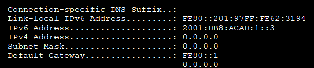

**Лабораторная работа. Настройка IPv6-адресов на сетевых устройствах**

/**Лабораторная работа. Настройка IPv6-адресов на сетевых устройствах** 

# **Топология**

# **Таблица адресации**

|**Устройство**|**Интерфейс**|**IPv6-адрес**|**Длина префикса**|**Шлюз по умолчанию**|
| :-: | :-: | :-: | :-: | :-: |
|R1|G0/0/0|2001:db8:acad:a::1|64|—|
|*R1*|G0/0/1|` `2001:db8:acad:1::1 |64|—|
|S1|VLAN 1|2001:db8:acad:1::b|64|—|
|PC-A|NIC|2001:db8:acad:1::3|64|fe80::1|
|PC-B|NIC|2001:db8:acad:a::3|64|fe80::1|
# **Задачи**
**Часть 1. Настройка топологии и конфигурация основных параметров маршрутизатора и коммутатора**

**Часть 2. Ручная настройка IPv6-адресов**

**Часть 3. Проверка сквозного соединения**
# **Общие сведения/сценарий**
В этой лабораторной работе  вы будете настраивать хосты и интерфейсы устройств с IPv6-адресами.  Для просмотра индивидуальных и групповых IPv6-адресов вы будете использовать команду **show**. Вы также будете проверять сквозное соединение с помощью команд **ping** and **traceroute**.

**Примечание**: Маршрутизаторы, используемые в практических лабораторных работах CCNA, - это Cisco 4221 с Cisco IOS XE Release 16.9.4 (образ universalk9). В лабораторных работах используются коммутаторы Cisco Catalyst 2960 с Cisco IOS версии 15.2(2) (образ lanbasek9). Можно использовать другие маршрутизаторы, коммутаторы и версии Cisco IOS. В зависимости от модели устройства и версии Cisco IOS доступные команды и результаты их выполнения могут отличаться от тех, которые показаны в лабораторных работах. Правильные идентификаторы интерфейса см. в сводной таблице по интерфейсам маршрутизаторов в конце лабораторной работы.

**Примечание**:  Убедитесь, что у всех маршрутизаторов и коммутаторов была удалена начальная конфигурация. Если вы не уверены, обратитесь к инструктору.

Примечание. Шаблон по умолчанию менеджера базы данных 2960 Switch Database Manager (SDM) не поддерживает IPv6. Перед назначением IPv6-адреса SVI VLAN 1 может понадобиться выполнение команды** sdm prefer dual-ipv4-and-ipv6 default **для включения IPv6-адресации.**

Примечание. **Шаблон default bias**, который по умолчанию используется диспетчером SDM (диспетчер базы данных коммутатора), не предоставляет возможностей адресации IPv6. Убедитесь, что SDM использует шаблон dual-ipv4-and-ipv6 или **lanbase-routing.** Новый шаблон будет использоваться после перезагрузки. 

S1# **show sdm prefer**

Чтобы установить шаблон dual-ipv4-and-ipv6 в качестве шаблона SDM по умолчанию, выполните следующие действия:

S1# **configure terminal**

S1(config)# **sdm prefer dual-ipv4-and-ipv6 default**

S1(config)# **end**

S1# **reload**
# **Необходимые ресурсы**
- 1 Маршрутизатор (Cisco 4221 с универсальным образом Cisco IOS XE версии 16.9.4 или аналогичным)
- 1 коммутатор (Cisco 2960 с ПО Cisco IOS версии 15.2(2) с образом lanbasek9 или аналогичная модель)
- 2 ПК (Windows и программа эмуляции терминала, такая как Tera Term)
- Консольные кабели для настройки устройств Cisco IOS через консольные порты.
- Кабели Ethernet, расположенные в соответствии с топологией

Примечание**. Интерфейсы Gigabit Ethernet на маршрутизаторах Cisco 4221 определяют скорость автоматически, поэтому для подключения маршрутизатора к PC-B можно использовать прямой кабель Ethernet. При использовании другой модели маршрутизатора Cisco может возникнуть необходимость использовать перекрестный кабель Ethernet.**
# **Инструкции**
1. ## **Настройка топологии и конфигурация основных параметров маршрутизатора и коммутатора**
После подключения сети, инициализации и перезагрузки маршрутизатора и коммутатора выполните следующие действия:
1. ### **Настройте маршрутизатор.**
Назначьте имя хоста и настройте основные параметры устройства.

1. ### **Настройте коммутатор.**
Назначьте имя хоста и настройте основные параметры устройства. 

1. ## **Ручная настройка IPv6-адресов**
   1. ### **Назначьте IPv6-адреса интерфейсам Ethernet на R1.**
      1. Назначьте глобальные индивидуальные IPv6-адреса, указанные в таблице адресации обоим интерфейсам Ethernet на R1.

*Откройте окно конфигурации*

1. Введите команду show ipv6 interface brief, чтобы проверить, назначен ли каждому интерфейсу корректный индивидуальный IPv6-адрес.

`   `

Примечание**. Отображаемый локальный адрес канала основан на адресации EUI-64, которая автоматически использует MAC-адрес интерфейса для создания 128-битного локального IPv6-адреса канала.**

1. Чтобы обеспечить соответствие локальных адресов канала индивидуальному адресу, вручную введите локальные адреса канала на каждом интерфейсе Ethernet на R1.

**Примечание**. Каждый интерфейс маршрутизатора относится к отдельной сети. Пакеты с локальным адресом канала никогда не выходят за пределы локальной сети, а значит, для обоих интерфейсов можно указывать один и тот же локальный адрес канала.

1. Используйте выбранную команду, чтобы убедиться, что локальный адрес связи изменен на fe80::1. 

*Закройте окно настройки.*
#### Вопрос:
Какие группы многоадресной рассылки назначены интерфейсу G0/0?

fe80::1
1. ### **Активируйте IPv6-маршрутизацию на R1.**
   1. В командной строке на PC-B введите команду **ipconfig**, чтобы получить данные IPv6-адреса, назначенного интерфейсу ПК.
#### Вопрос:
Назначен ли индивидуальный IPv6-адрес сетевой интерфейсной карте (NIC) на PC-B?

1. Активируйте IPv6-маршрутизацию на R1 с помощью команды **IPv6 unicast-routing**.

*, чтобы убедиться, что новая многоадресная группа назначена интерфейсу G0/0/0. Обратите внимание, что в списке групп для интерфейса G0/0 отображается группа многоадресной рассылки всех маршрутизаторов (FF02::2).*

**Примечание**. Это позволит компьютерам получать IP-адреса и данные шлюза по умолчанию с помощью функции SLAAC (Stateless Address Autoconfiguration (Автоконфигурация без сохранения состояния адреса)).

PC-0

PC-1

1. Теперь, когда R1 входит в группу многоадресной рассылки всех маршрутизаторов, еще раз введите команду **ipconfig** на PC-B. Проверьте данные IPv6-адреса.

#### Вопрос:
Почему PC-B получил глобальный префикс маршрутизации и идентификатор подсети, которые вы настроили на R1?
1. ### **Назначьте IPv6-адреса интерфейсу управления (SVI) на S1.**
   1. Назначьте адрес IPv6 для S1. Также назначьте этому интерфейсу локальный адрес канала.
   1. Проверьте правильность назначения IPv6-адресов интерфейсу управления с помощью команды show ipv6 interface vlan1.

*Закройте окно настройки.*
1. ### **Назначьте компьютерам статические IPv6-адреса.**
   1. Откройте окно Свойства Ethernet для каждого ПК и назначьте адресацию IPv6.

PC0

` `PC1

1. Убедитесь, что оба компьютера имеют правильную информацию адреса IPv6. Каждый компьютер должен иметь два глобальных адреса IPv6: один статический и один SLACC
1. ## **Проверка сквозного подключения**
С PC-A отправьте эхо-запрос на **FE80::1**. Это локальный адрес канала, назначенный G0/1 на R1.

Отправьте эхо-запрос на интерфейс управления S1 с PC-A.

Введите команду **tracert** на PC-A, чтобы проверить наличие сквозного подключения к PC-B.

С PC-B отправьте эхо-запрос на PC-A.

С PC-B отправьте эхо-запрос на локальный адрес канала G0/0 на R1.

**Примечание.**  В случае отсутствия сквозного подключения проверьте, правильно ли указаны IPv6-адреса на всех устройствах.
# **Вопросы для повторения**
1. Почему обоим интерфейсам Ethernet на R1 можно назначить один и тот же локальный адрес канала — FE80::1?

Находятся в разных интерфейсах

1. Какой идентификатор подсети в индивидуальном IPv6-адресе 2001:db8:acad::aaaa:1234/64?

`      `2001:db8:acad::aaaa
# **Сводная таблица по интерфейсам маршрутизаторов**

|**Модель маршрутизатора**|**Интерфейс Ethernet № 1**|**Интерфейс Ethernet № 2**|**Последовательный интерфейс № 1**|**Последовательный интерфейс № 2**|
| :-: | :-: | :-: | :-: | :-: |
|1 800|Fast Ethernet 0/0 (F0/0)|Fast Ethernet 0/1 (F0/1)|Serial 0/0/0 (S0/0/0)|Serial 0/0/1 (S0/0/1)|
|1900|Gigabit Ethernet 0/0 (G0/0)|Gigabit Ethernet 0/1 (G0/1)|Serial 0/0/0 (S0/0/0)|Serial 0/0/1 (S0/0/1)|
|2801|Fast Ethernet 0/0 (F0/0)|Fast Ethernet 0/1 (F0/1)|Serial 0/1/0 (S0/1/0)|Serial 0/1/1 (S0/1/1)|
|2811|Fast Ethernet 0/0 (F0/0)|Fast Ethernet 0/1 (F0/1)|Serial 0/0/0 (S0/0/0)|Serial 0/0/1 (S0/0/1)|
|2900|Gigabit Ethernet 0/0 (G0/0)|Gigabit Ethernet 0/1 (G0/1)|Serial 0/0/0 (S0/0/0)|Serial 0/0/1 (S0/0/1)|
|4221|Gigabit Ethernet 0/0/0 (G0/0/0)|Gigabit Ethernet 0/0/1 (G0/0/1)|Serial 0/1/0 (S0/1/0)|Serial 0/1/1 (S0/1/1)|
|4300|Gigabit Ethernet 0/0/0 (G0/0/0)|Gigabit Ethernet 0/0/1 (G0/0/1)|Serial 0/1/0 (S0/1/0)|Serial 0/1/1 (S0/1/1)|
**Примечание**. Чтобы определить конфигурацию маршрутизатора, можно посмотреть на интерфейсы и установить тип маршрутизатора и количество его интерфейсов. Перечислить все комбинации конфигураций для каждого класса маршрутизаторов невозможно. Эта таблица содержит идентификаторы для возможных комбинаций интерфейсов Ethernet и последовательных интерфейсов на устройстве. Другие типы интерфейсов в таблице не представлены, хотя они могут присутствовать в данном конкретном маршрутизаторе. В качестве примера можно привести интерфейс ISDN BRI. Строка в скобках — это официальное сокращение, которое можно использовать в командах Cisco IOS для обозначения интерфейса.

*Конец документа*
© ã 2013 г. - гггг Корпорация Cisco и/или ее дочерние компании. Все права защищены. Открытая информация Cisco 	страница 2** 4**	www.netacad.com
